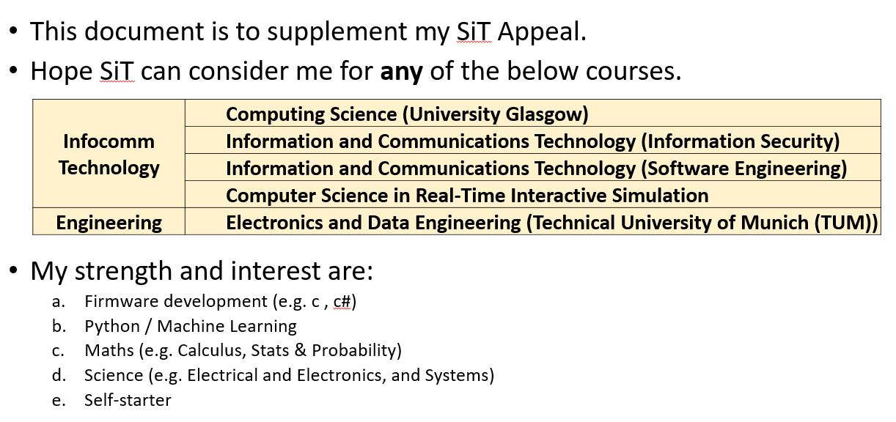

</head>
<body>
<h1><b>For Rommel Sim Appeal for SUSS - Business Analytics</b></h1>
<h1 style="page-break-before:always; "><b>Agenda</b></h1>
<ul>
<li>Purpose for these slides </li>
  
<li>Certificates and Testimony</li>
<li>Before we begin…</li>
<li>Two Broad Types of Machine Learning</li>
<li>Supervised Machine Learning (General Steps)</li>
<li>Classification Report</li>
<li>Confusion matrix</li>
<li>Unsupervised Learning (Principle Component Analysis)</li>
<li>Mini Projects (Singapore Pool 4D, UCI Power Plant)</li>
<li>Machine Learning Cheat Sheet</li>
<li>Others (e.g. Public Info)</li>
</ul>
<h1 style="page-break-before:always; "><b>Purpose of these slides</b></h1>
<h1 style="page-break-before:always; "><b>Certificates - Business Courses</b></h1> 
<h1 style="page-break-before:always; "><b>Certificates - Machine Learning Course</b></h1>
<h1 style="page-break-before:always; "><b>Certificates - Python Data Structures, Algorithm and Interviews, Web Development BootCamp 2021</b></h1>    
<h1 style="page-break-before:always; "><b>Testimony</b></h1>
<h1 style="page-break-before:always; "><b>Before We Begin...</b></h1>
<h1 style="page-break-before:always; "><b>Two Broad Types of Machine Learning</b></h1>  
  

<ul>
<li>Classification Report : measures the <i><b>quality</b></i> of predictions</li>
<li>Accuracy rating</li>
<ul>
<li>&gt; 85 is good, &gt; 90 is very good, </li>
<li>&gt; 95 is excellent</li>
</ul>
</ul>

<b>Titanic Dataset</b>

Sample Output

<h1 style="page-break-before:always; "><b>Compare results (between Neural Network and Log Reg)</b></h1>
<ul>
<li>Data suggests Neural Network is more superior model.</li>
<li>But Neural Network seed value is critical to a excellent model</li>
</ul>

<b>Breast Cancer Wisconsin (Diagnostic) Data Set</b>

Sample Output

Sample Output

<b>Titanic Dataset</b>

<h1 style="page-break-before:always; "><b>Confusion Matrix (2x2 Matrix)</b></h1>
<ul>
<li>Simple Matrix showing True Positives (TP), True Negative (TN), False Positive (FP) and False Negatives (FN)</li>
</ul>

TP

TN

FP

FN

Sample Output

<h1 style="page-break-before:always; "><b>Unsupervised Learning (Principle Component Analysis)</b></h1>
<ul>
<li>With too many possible factors (x-inputs) contributing to the Outcome (y-values), we need to reduce the factors (x-inputs) to those that are highly correlated to the Outcomes (y-outputs)</li>
</ul>

My codes for Kaggle Breast Cancer dataset (extraction)

<b>Breast Cancer Wisconsin (Diagnostic) Data Set</b>

Sample Code

Sample Output

<h1 style="page-break-before:always; ">Mini Project1 : Singapore Pools (4D Dataset)</h1>
<ul>
<li>55 sets of Draws were mapped to fig on right.</li>
<li>Total Data points : 1210 data points</li>
<li>Observations :</li>
<ul>
<li>There is no clustering nor linearity seen between data points, but there seems to be some level of polynomial relationships (i.e. green-blue zone).</li>
<li>White spaces - likewise, no clustering nor linearity</li>
</ul>
<li>Conclusion :</li>
<h2>May need more dataset to assess polynomial patterns and/or apply a different model (e.g. historical reduction).</h2>
</ul>

Figure : 4D mapping with seaborn 

<b>Singapore Pools 4D</b>

<h1 style="page-break-before:always; ">Mini Project2 : Outputs</h1>
<ul>
<li>r2 score is used for continuous dataset</li>
</ul>

DataFrame Properties

Predict, R2 score

UCI Machine Learning Repository Combined Cycle Power Plant Data Set

<h1 style="page-break-before:always; ">Machine Learning Algorithm Cheat sheet</h1>

Source : sas.com

Legend : modelled

<h1 style="page-break-before:always; ">Others – Public info</h1>
<h1 style="page-break-before:always; ">Machine Learning Process</h1>

Source : AI Labpage

</body>
</html>
